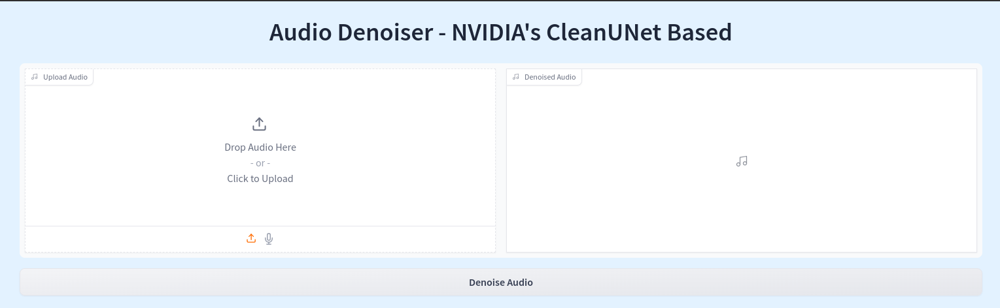

## Speech Denoiser System (With NVIDIA CleanUNet)
Developed by <b> Mahfuzul Kabir</b>, \
Machine Learning Engineer, \
ACI Limited \
Website: <a href = mahfuzulkabir.com>MahfuzulKabir.com</a>



## Description:
This system is the backbone of speech denoiser system, incorporating NVIDIA's CleanUNet. The denoiser module is built for use in any python system with ease. The system also offers an API for usage in developments.

## Algorithmic difficulties
The CleanUNet is a very GPU hungry system. Upon my own testing, it can take upto 10GB of GPU usage for a 3 minute audio file (I know, crazy and shouldn't be like that at all). I guess the underlying reason is very poor handling and optimization of data usage in CleanUNet.

To tackle such situation, I extensively used batching. After some initial EDA, I found that the system can handle audio file roughly upto 3 seconds without any problem (I have checked with 60s audio file and it still crashes CUDA). So, each audio file is divided in chunks of 3 seconds and created batches, hoping for batch inference achieving faster and optimized system.

I wish that was the case. In case of longer audios, the number of batches are huge and yet again, CleanUNet fails to handle data properly, causing to crash the system and demanding 5GB of GPU memory while inferencing with 3s audio chunks. So, I batched them. The underlying code uses batches of 20 audio chunks. The number of each batch containing audio chunks and the duration of each audio chunks can be controlled using <b>'chunk_length_s'</b> and <b>'max_batch_size'</b> arguements while initializing the module (<i>default values are defined, so if you don't want to experiment, no need to worry</i>).

This approach creates amazing results. A 50 minute audio from World Economic Forum took only 4s to process. And about performance of CleanUNet itself, give it a try and see for yourself (spoiler: it's amazinggg).

I plan to add more speech enhancement options in this module as time goes. Surely you can contribute yourself or give me ideas that can be done as well.

Thank you for using this system. Give it a <b>STAR</b> if it helps you in any way.

## Usage
#### Use with user interface:
The latest addition to this project is the addition of gradio interface for non-tech people. Simple run the following codes in your terminal and a gradio user interface will be launched.

```
# Clone the git repository
git clone https://github.com/Kabir5296/Speech-Denoiser-System.git

# Change directory
cd Speech-Denoiser-System

# Install necessary modules
pip install -r requirements.txt

# Launch gradio_app.py
python gradio_app.py
```

The gradio app will be accessible at https://127.0.0.0:7862 

#### Use wiith API:
To use with API follow the commands below. The system was built on python3.9 and it's preferable to use in same version. Create a python environment using python3.9 if needed.

```
# Clone the git repository
git clone https://github.com/Kabir5296/Speech-Denoiser-System.git

# Change directory
cd Speech-Denoiser-System

# Install necessary modules
pip install -r requirements.txt

# Launch main.py
python main.py
```

The APIs can be accessed at https://127.0.0.0:8877 and access the swagger at https://127.0.0.0:8877/docs

#### Use with denoiser module:
For usage in development, the denoiser module can be used. To do so, simply initialize the DenoiserAudio module. The following codes can be helpful.

```
from denoiser import DenoiserAudio

denoise = DenoiserAudio()

denoised_audio = DenoiserAudio("--> path/to/your/audio/file <--")
```

To save the denoised audio use the following code.

```
import torchaudio

torchaudio.save(output_filename, 
                torch.from_numpy(denoised_audio).unsqueeze(0), 
                sample_rate = 16000)
```

## Citation
Don't forget to cite NVIDIA's original paper on CleanUNet. Kudos to them (not for handling the data efficiently though :p )
```
@inproceedings{kong2022speech,
  title={Speech Denoising in the Waveform Domain with Self-Attention},
  author={Kong, Zhifeng and Ping, Wei and Dantrey, Ambrish and Catanzaro, Bryan},
  booktitle={ICASSP 2022-2022 IEEE International Conference on Acoustics, Speech and Signal Processing (ICASSP)},
  pages={7867--7871},
  year={2022},
  organization={IEEE}
}
```